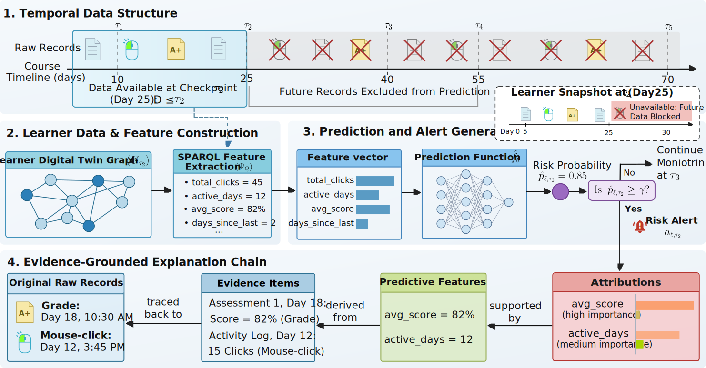

# Evidence-Grounded Early-Warning Pipeline

Anonymous reproducibility artifact accompanying a submission under review.

The project implements an incremental Learner Digital Twin (LDT) for early-warning learning analytics. At each temporal checkpoint, it replays learner activity and assessment records into an RDF observation graph, extracts predictive features from that graph, generates at-risk predictions, and materializes feature attributions and evidence chains back into the graph.



## What This Artifact Provides

- A lightweight LDT ontology and SHACL integrity constraints.
- Incremental RDF graph construction from OULAD learning traces and assessments.
- Paired raw-table and knowledge-graph-mediated feature extraction.
- Leakage-controlled, presentation-based temporal evaluation at Weeks 4, 8, and 12.
- Core baselines (logistic regression and XGBoost) and extended tabular models (Random Forest, Extra Trees, HistGradientBoosting, LightGBM, CatBoost, and a TabTransformer-style model).
- SHAP-based alert attributions, evidence selection, provenance paths, and grounding metrics.
- Scripts to aggregate manuscript tables and generate figures.

## Repository Layout

```text
config/        Experiment configurations and hyperparameters
experiments/   Launchers, aggregation, and visualization entry points
ontology/      LDT ontology and SHACL shapes
sparql/        Feature, explanation, and validation queries
src/           Data, graph, feature, model, evidence, and result modules
tests/         Data-free artifact validation tests
Oulab/         Local OULAD CSV location (not versioned)
results/       Generated outputs (not versioned)
run_pipeline.sh Ubuntu/Linux one-command experiment launcher
```

## Data Access

This repository intentionally does **not** distribute OULAD CSV files, learner-derived RDF graphs, or run logs. They are either third-party data or generated artifacts that can be large. Obtain OULAD from an authorized source, such as the [dataset publication](https://doi.org/10.1038/sdata.2017.171), and comply with its applicable terms.

Place these seven CSV files in `Oulab/`:

```text
assessments.csv
courses.csv
studentAssessment.csv
studentInfo.csv
studentRegistration.csv
studentVle.csv
vle.csv
```

The expected layout is documented in [Oulab/README.md](Oulab/README.md).

## Requirements

- Python 3.10 or later
- Ubuntu/Linux with Bash for the one-command launcher
- The OULAD files described above

## Quick Start

The first run creates `.venv`, installs the required dependencies, executes the experiment, aggregates tables, and generates figures.

```bash
chmod +x run_pipeline.sh
./run_pipeline.sh --preset smoke
```

The `smoke` preset runs the Week 4 core comparison for module DDD. It is the right first check after downloading the data.

To rerun without installing dependencies again:

```bash
./run_pipeline.sh --preset smoke --skip-install
```

## Reproducing the Experiments

| Preset | Scope | Intended use |
|---|---|---|
| `smoke` | DDD, Week 4, core models | Installation and end-to-end validation |
| `core` | DDD, Weeks 4/8/12, core models | Fast module-level development run |
| `full_run` | All eligible modules, core models | Recommended all-module reproduction run |
| `tab_transformer` | DDD, core models plus TABTX | Neural-model validation |
| `sklearn_modern` | DDD, core models plus RF/ET/HGB/TABTX | Extended benchmark without LightGBM/CatBoost |
| `modern` | DDD, full modern model set | Extended benchmark |
| `run_full` | All eligible modules, full model set and XGBoost grid search | Deliberately expensive complete benchmark |

Run the main all-module experiment:

```bash
./run_pipeline.sh --preset full_run
```

The full benchmark can take a very long time. It requires an explicit confirmation:

```bash
CONFIRM_LONG_RUN=1 ./run_pipeline.sh --preset run_full
```

Each preset maps to a version-controlled configuration under `config/`. The fixed hyperparameters, checkpoints, seed, and model choices used for a run are therefore inspectable and reproducible.

## Outputs

Each run writes generated artifacts below `results/`:

```text
results/tables/   Performance, grounding, parity, timing, and readiness tables
results/figures/  Publication-oriented PNG figures and a figure manifest
results/graphs/   Incremental RDF graphs and materialized alert evidence paths
results/logs/     Timestamped launcher logs
```

To regenerate figures from existing result tables without rerunning models:

```bash
python experiments/visualize_results.py --results results --output results/figures
```

## Data-Free Validation

The repository includes checks that do not require OULAD. They parse the ontology and SHACL shapes, compile the SPARQL feature queries, validate configuration files, and compile the Python source.

```bash
python -m pip install pyyaml rdflib
python -m compileall src experiments
python -m unittest discover -s tests -v
```

GitHub Actions runs these checks for every push and pull request.

## Reproducibility Notes

- The experimental protocol uses 2013 presentations for training and 2014 presentations for testing.
- At-risk labels are `Fail` and `Withdrawn`; learners who withdrew on or before course start are excluded.
- The default random seed is `42`.
- Raw and KG feature matrices are compared directly and recorded in `feature_parity.csv`.
- SHACL validation is run for observation graphs and analytic graph write-back.
- Hardware, library version, and parallelism can affect runtime and neural-model floating-point results. Record them with the generated logs when reporting a new run.

## Anonymous Review Artifact

This repository is provided for anonymous peer review. Author names, formal
citation metadata, and archival release information are retained locally and
will be added after the review period.

## License and Third-Party Material

The source code is available under the [MIT License](LICENSE). OULAD is a separate third-party dataset and is not covered by this repository's code license. Do not commit raw data, learner-level generated graphs, credentials, or local experiment logs.
